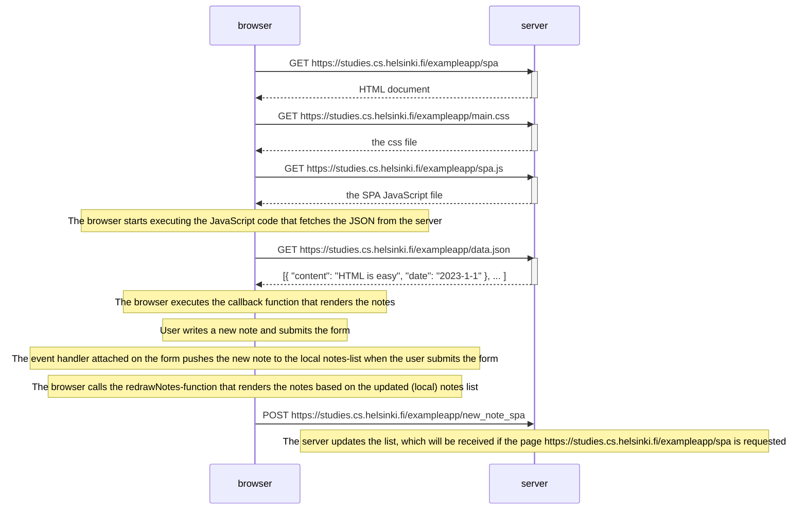

```mermaid
sequenceDiagram
    participant browser
    participant server
    
    browser->>server: GET https://studies.cs.helsinki.fi/exampleapp/spa
    activate server
    server-->>browser: HTML document
    deactivate server
    
    browser->>server: GET https://studies.cs.helsinki.fi/exampleapp/main.css
    activate server
    server-->>browser: the css file
    deactivate server
    
    browser->>server: GET https://studies.cs.helsinki.fi/exampleapp/spa.js
    activate server
    server-->>browser: the SPA JavaScript file
    deactivate server
    
    Note over browser: The browser starts executing the JavaScript code that fetches the JSON from the server
    
    browser->>server: GET https://studies.cs.helsinki.fi/exampleapp/data.json
    activate server
    server-->>browser: [{ "content": "HTML is easy", "date": "2023-1-1" }, ... ]
    deactivate server    

    Note over browser: The browser executes the callback function that renders the notes

    Note over browser: User writes a new note and submits the form

    Note over browser: The event handler attached on the form pushes the new note to the local notes-list when the user submits the form

    Note over browser: The browser calls the redrawNotes-function that renders the notes based on the updated (local) notes list

    browser->>server: POST https://studies.cs.helsinki.fi/exampleapp/new_note_spa
    activate server

    Note over server: The server updates the list, which will be received if the page https://studies.cs.helsinki.fi/exampleapp/spa is requested
```
