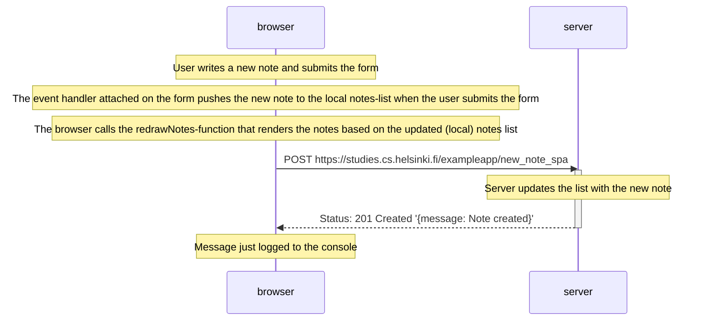

```mermaid
sequenceDiagram
    participant browser
    participant server 
 
    Note over browser: User writes a new note and submits the form

    Note over browser: The event handler attached on the form pushes the new note to the local notes-list when the user submits the form

    Note over browser: The browser calls the redrawNotes-function that renders the notes based on the updated (local) notes list

    browser->>server: POST https://studies.cs.helsinki.fi/exampleapp/new_note_spa
    activate server
    Note over server: Server updates the list with the new note
    server-->>browser: Status: 201 Created '{message: Note created}'
    deactivate server

    Note over browser: Message just logged to the console
```